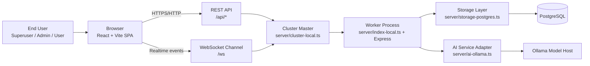
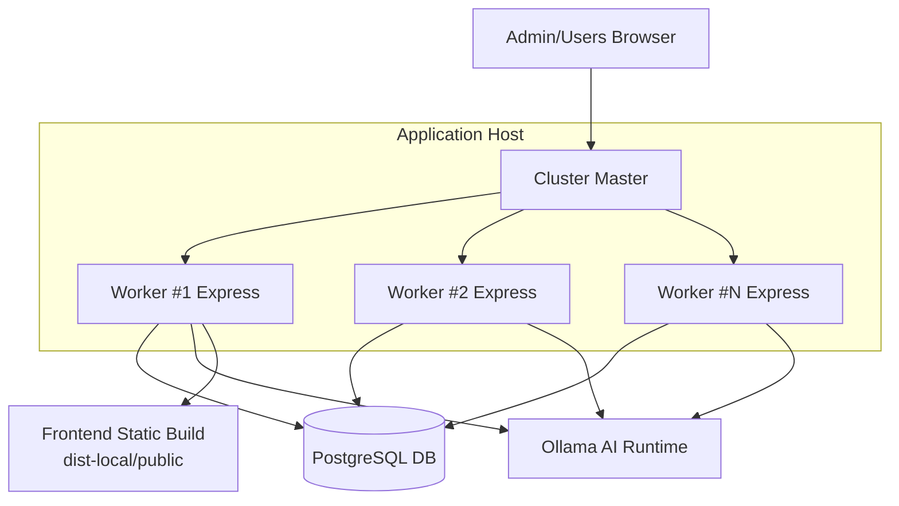
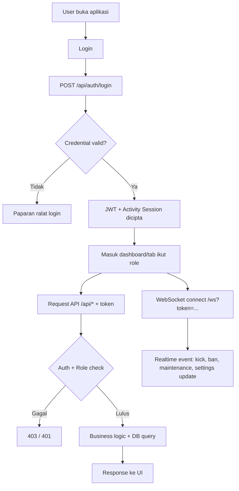
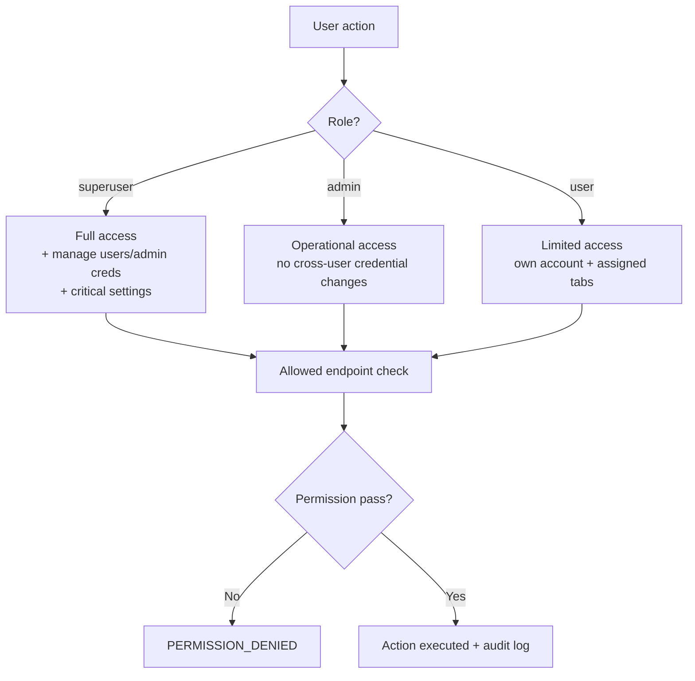
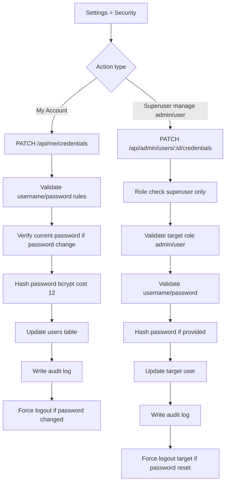
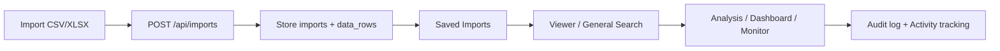
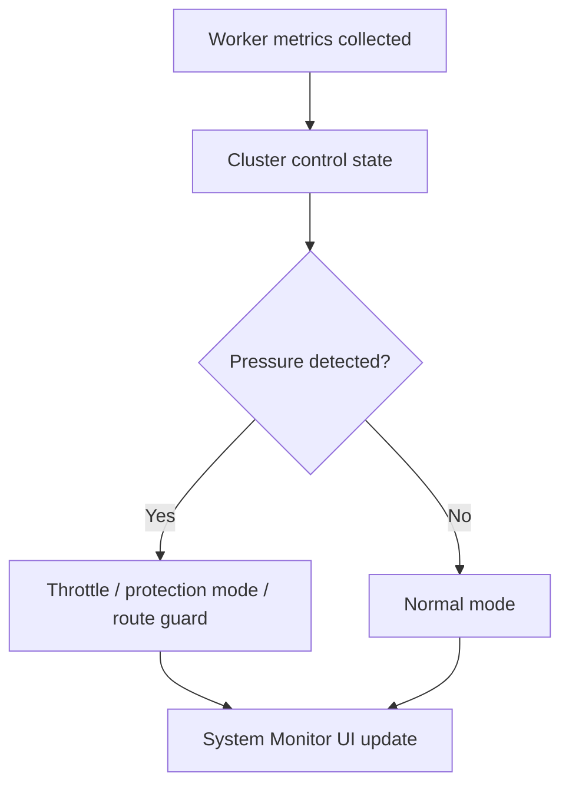

# SQR System Flowchart & Architecture (Client Briefing)

Dokumen ini direka untuk memudahkan briefing client bagi sistem:
- **SQR - Sumbangan Query Rahmah**
- Stack: **React + Vite**, **Node.js + Express**, **PostgreSQL**, **WebSocket**, **Cluster Worker**, **Ollama AI**

## 1) High-Level Architecture

## 2) Runtime / Deployment Architecture (Cluster)

Nota untuk client:
- Master process mengawal bilangan worker dan kestabilan.
- Worker handle API request sebenar.
- Jika satu worker gagal, master boleh replace worker tanpa matikan keseluruhan sistem.

## 3) End-to-End User Flow

## 4) Role-Based Access Flow

## 5) Credential Management Flow (Security Tab)

## 6) Data Lifecycle Flow (Import -> Search -> Analysis)

## 7) Monitoring & Stability Flow

## 8) Talking Points Untuk Brief Client

Gunakan poin ringkas ini semasa presentation:
1. **Secure by design**: semua endpoint penting dilindungi auth + role check.
2. **Role separation jelas**: superuser, admin, user mempunyai sempadan kuasa yang ketat.
3. **Auditability**: action kritikal direkod dalam audit logs.
4. **Scalable runtime**: cluster worker untuk kestabilan operasi.
5. **Realtime governance**: WebSocket untuk status sesi, kick/ban, maintenance.
6. **Operational readiness**: backup/restore, monitor, activity, analytics.

## 9) Appendix: Modul Utama Mengikut Role

| Modul | Superuser | Admin | User |
|---|---|---|---|
| Search | Ya | Ya | Ya |
| Import/Saved/Viewer | Ya | Ya | Ya (ikut setting tab) |
| System Monitor | Ya | Ya (ikut setting tab) | Ya (ikut setting tab) |
| Backup create/restore/delete | Ya | Ya | Tidak |
| System Settings | Ya | Ya (ikut permission) | Tidak |
| Account Security (own) | Ya | Ya | Ya |
| User Credential Management | Ya | Tidak | Tidak |

