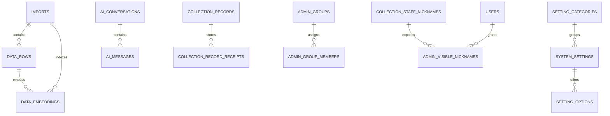

# ER Diagram

This diagram intentionally covers the reviewed Drizzle-managed relationship subset exported from [shared/schema-postgres.ts](../shared/schema-postgres.ts). It does **not** attempt to mirror every bootstrap-managed or legacy compatibility table. That scope keeps the diagram reviewable and reduces stale-manual-doc risk.

## Covered Drizzle Relation Exports

- `importRelations`
- `dataRowRelations`
- `dataEmbeddingRelations`
- `aiConversationRelations`
- `aiMessageRelations`
- `settingCategoryRelations`
- `systemSettingRelations`
- `settingOptionRelations`
- `collectionRecordRelations`
- `collectionRecordReceiptRelations`
- `adminGroupRelations`
- `adminGroupMemberRelations`
- `collectionStaffNicknameRelations`
- `adminVisibleNicknameRelations`

## Governance Notes

- Use [drizzle/README.md](../drizzle/README.md) plus `npm run verify:db-schema-governance` when changing ownership between Drizzle-managed and bootstrap-managed tables.
- If you add or remove a relation export in `shared/schema-postgres.ts`, update this diagram in the same change so the documented scope stays honest.
